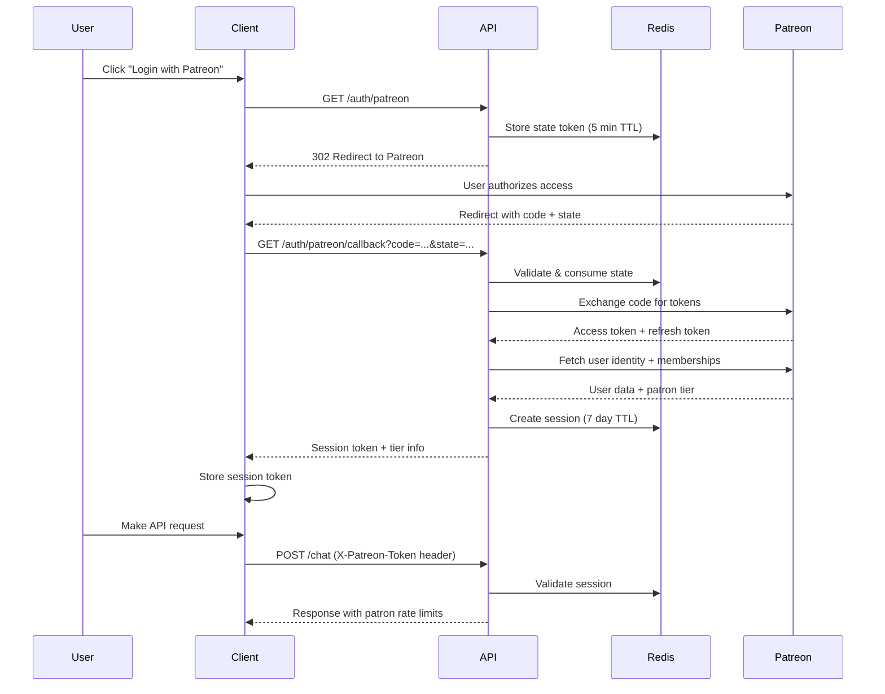

# Deadlock AI Assistant API Integration Guide

**Version:** 1.1.0
**Base URL:** `https://your-deployment-url`

This document provides comprehensive documentation for third-party developers integrating with the Deadlock AI Assistant
API.

---

## Table of Contents

1. [Overview](#overview)
2. [Authentication](#authentication)
3. [Patreon Authentication](#patreon-authentication)
    - [OAuth2 Flow](#oauth2-flow)
    - [Patron Tier Levels](#patron-tier-levels)
    - [Patreon Auth Endpoints](#patreon-auth-endpoints)
    - [Session Management](#session-management)
    - [TypeScript Integration Example](#typescript-integration-example)
4. [Endpoints](#endpoints)
    - [Health Check](#health-check)
    - [Chat](#chat)
5. [Request/Response Models](#requestresponse-models)
6. [Server-Sent Events (SSE)](#server-sent-events-sse)
7. [Error Handling](#error-handling)
8. [Status Codes](#status-codes)
9. [Rate Limiting](#rate-limiting)
10. [Integration Examples](#integration-examples)
11. [Best Practices](#best-practices)

---

## Overview

The Deadlock AI Assistant API provides a stateless REST interface for conversational AI interactions. Key features
include:

- **Streaming Responses**: Real-time response streaming via Server-Sent Events (SSE)
- **Conversation Persistence**: Optional conversation history tracking via conversation IDs
- **Tool Integration**: AI can invoke tools during conversations with progress events
- **Multiple Authentication Methods**: API keys, Patreon OAuth2, or Cloudflare Turnstile tokens
- **Patron Tiers**: Patreon supporters receive higher rate limits based on subscription level

---

## Authentication

All endpoints except public paths require authentication. The API supports two authentication methods.

### Public Paths (No Authentication Required)

| Path                     | Description                        |
|--------------------------|------------------------------------|
| `/health`                | Health check endpoint              |
| `/docs`                  | OpenAPI documentation (Swagger UI) |
| `/openapi.json`          | OpenAPI schema                     |
| `/redoc`                 | ReDoc documentation                |
| `/auth/patreon`          | Patreon OAuth2 authorization       |
| `/auth/patreon/callback` | Patreon OAuth2 callback            |
| `/auth/patreon/logout`   | Patreon session logout             |
| `/auth/patreon/status`   | Patreon patron status              |

### Method 1: API Key Authentication (Recommended)

Pass your API key in the `X-API-Key` header.

```http
POST /chat HTTP/1.1
Host: api.example.com
X-API-Key: your-api-key-here
Content-Type: application/json

{"message": "Hello, assistant!"}
```

### Method 2: Cloudflare Turnstile Token

For browser-based applications, pass a Turnstile token in the `cf-turnstile-response` header.

```http
POST /chat HTTP/1.1
Host: api.example.com
cf-turnstile-response: your-turnstile-token
Content-Type: application/json

{"message": "Hello, assistant!"}
```

### Method 3: Patreon Token Authentication

For users who have authenticated via Patreon OAuth2, pass the session token in the `X-Patreon-Token` header.

```http
POST /chat HTTP/1.1
Host: api.example.com
X-Patreon-Token: your-patreon-session-token
Content-Type: application/json

{"message": "Hello, assistant!"}
```

This method provides tiered rate limits based on the user's Patreon subscription level. See
[Patreon Authentication](#patreon-authentication) for the complete OAuth2 flow.

### Authentication Precedence

1. If `X-API-Key` header is present, only API key validation is performed
2. If `X-Patreon-Token` header is present (and no API key), Patreon session validation is performed
3. If `cf-turnstile-response` header is present (and no API key or Patreon token), Turnstile validation is performed
4. If no authentication header is present, the request is rejected with 401 Unauthorized

### Authentication Failure Response

```json
{
  "error": "Invalid or missing API key",
  "code": "AUTH_FAILED",
  "request_id": "550e8400-e29b-41d4-a716-446655440000"
}
```

---

## Patreon Authentication

Patreon OAuth2 integration allows users to authenticate with their Patreon account and receive higher API rate limits
based on their subscription tier.

### OAuth2 Flow



### Patron Tier Levels

Patrons receive higher rate limits based on their subscription amount:

| Tier | Name        | Minimum Pledge | Rate Limit     |
|------|-------------|----------------|----------------|
| 0    | Non-Patron  | -              | 100 req/min    |
| 1    | Supporter   | $5/month       | 200 req/min    |
| 2    | Contributor | $10/month      | 500 req/min    |
| 3    | Champion    | $20/month      | 1000 req/min   |

Tier thresholds and rate limits are configurable via environment variables.

### Patreon Auth Endpoints

All Patreon authentication endpoints are publicly accessible (no authentication required).

#### GET /auth/patreon

Initiate the Patreon OAuth2 authorization flow.

**Response:** `302 Redirect` to Patreon authorization URL

The endpoint generates a secure state parameter stored in Redis with a 5-minute TTL for CSRF protection.

**Error Responses:**

| Status | Description                         |
|--------|-------------------------------------|
| 503    | Patreon authentication not enabled  |

---

#### GET /auth/patreon/callback

Handle the OAuth2 callback from Patreon.

**Query Parameters:**

| Parameter           | Type     | Description                                  |
|---------------------|----------|----------------------------------------------|
| `code`              | `string` | Authorization code from Patreon              |
| `state`             | `string` | State parameter for CSRF validation          |
| `error`             | `string` | Error code if user denied access (optional)  |
| `error_description` | `string` | Human-readable error message (optional)      |

**Success Response (200):**

```json
{
  "session_token": "550e8400-e29b-41d4-a716-446655440000",
  "tier": 2,
  "tier_name": "Contributor",
  "rate_limit": 500
}
```

**Response Fields:**

| Field           | Type     | Description                                    |
|-----------------|----------|------------------------------------------------|
| `session_token` | `string` | Session token for API authentication           |
| `tier`          | `int`    | Patron tier level (0-3)                        |
| `tier_name`     | `string` | Human-readable tier name                       |
| `rate_limit`    | `int`    | Requests per minute for this tier              |

**Error Responses:**

| Status | Condition                                    |
|--------|----------------------------------------------|
| 400    | Missing state parameter                      |
| 400    | Invalid or expired state parameter           |
| 400    | Missing authorization code                   |
| 400    | Patreon authorization denied by user         |
| 400    | Token exchange failed                        |
| 400    | Failed to fetch user data                    |
| 503    | Patreon authentication not enabled           |

---

#### POST /auth/patreon/logout

End an authenticated Patreon session.

**Headers:**

| Header            | Required | Description           |
|-------------------|----------|-----------------------|
| `X-Patreon-Token` | Yes      | The session token     |

**Success Response (200):**

```json
{
  "message": "Successfully logged out"
}
```

**Error Responses:**

| Status | Condition                      |
|--------|--------------------------------|
| 401    | Missing X-Patreon-Token header |
| 401    | Invalid or expired session     |

---

#### GET /auth/patreon/status

Get the current patron status for an authenticated session.

**Headers:**

| Header            | Required | Description           |
|-------------------|----------|-----------------------|
| `X-Patreon-Token` | Yes      | The session token     |

**Success Response (200):**

```json
{
  "authenticated": true,
  "tier": 2,
  "tier_name": "Contributor",
  "rate_limit": 500,
  "email": "u***@example.com",
  "expires_at": "2024-01-15T10:30:00+00:00"
}
```

**Response Fields:**

| Field           | Type      | Description                                         |
|-----------------|-----------|-----------------------------------------------------|
| `authenticated` | `boolean` | Always `true` for valid sessions                    |
| `tier`          | `int`     | Patron tier level (0-3)                             |
| `tier_name`     | `string`  | Human-readable tier name                            |
| `rate_limit`    | `int`     | Requests per minute for this tier                   |
| `email`         | `string`  | Masked email address (e.g., `u***@example.com`)     |
| `expires_at`    | `string`  | Session expiration timestamp (ISO 8601 format)      |

**Error Responses:**

| Status | Condition                      |
|--------|--------------------------------|
| 401    | Missing X-Patreon-Token header |
| 401    | Invalid or expired session     |

### Session Management

#### Session Expiration

Sessions have a **7-day rolling expiration**. The TTL is automatically extended when:

- The access token is refreshed
- The patron status is refreshed
- Any session update occurs

If a session is not used for 7 days, it expires and the user must re-authenticate.

#### Automatic Token Refresh

Access tokens from Patreon expire after approximately 1 hour. The API automatically refreshes tokens:

1. On each authenticated request, the API checks if the access token expires within 5 minutes
2. If expiring soon, the refresh token is used to obtain new tokens
3. The session is updated with new tokens and the TTL is extended

If token refresh fails (e.g., user revoked access on Patreon), the session is invalidated and the API returns:

```json
{
  "error": "Session expired - token refresh failed",
  "code": "TOKEN_REFRESH_FAILED"
}
```

#### Periodic Patron Status Refresh

To reflect subscription changes (upgrades, downgrades, cancellations), the API periodically refreshes patron status:

1. Every hour, the API checks the user's current membership status with Patreon
2. If the patron's tier has changed, the session is updated with the new tier and rate limit
3. If the patron is no longer active, they are downgraded to tier 0

This refresh happens in the background and doesn't block requests. If the refresh fails, the cached tier is used.

### TypeScript Integration Example

```typescript
// Types for Patreon authentication
interface PatreonCallbackResponse {
    session_token: string;
    tier: number;
    tier_name: string;
    rate_limit: number;
}

interface PatreonStatusResponse {
    authenticated: boolean;
    tier: number;
    tier_name: string;
    rate_limit: number;
    email: string;
    expires_at: string;
}

interface PatreonLogoutResponse {
    message: string;
}

class PatreonAuthClient {
    private baseUrl: string;
    private sessionToken: string | null = null;

    constructor(baseUrl: string) {
        this.baseUrl = baseUrl;
    }

    /**
     * Initiate Patreon login by redirecting to the auth endpoint.
     * The API will redirect the user to Patreon's authorization page.
     */
    login(): void {
        window.location.href = `${this.baseUrl}/auth/patreon`;
    }

    /**
     * Handle the OAuth2 callback. Call this on the callback page
     * to exchange the authorization code for a session token.
     */
    async handleCallback(): Promise<PatreonCallbackResponse> {
        const params = new URLSearchParams(window.location.search);
        const code = params.get('code');
        const state = params.get('state');
        const error = params.get('error');

        if (error) {
            throw new Error(`Patreon authorization failed: ${params.get('error_description') || error}`);
        }

        const response = await fetch(
            `${this.baseUrl}/auth/patreon/callback?code=${code}&state=${state}`
        );

        if (!response.ok) {
            const errorData = await response.json();
            throw new Error(errorData.detail || 'Callback failed');
        }

        const data: PatreonCallbackResponse = await response.json();
        this.sessionToken = data.session_token;

        // Store token for persistence (use secure storage in production)
        localStorage.setItem('patreon_token', data.session_token);

        return data;
    }

    /**
     * Get the current patron status.
     */
    async getStatus(): Promise<PatreonStatusResponse> {
        const token = this.getToken();
        if (!token) {
            throw new Error('Not authenticated');
        }

        const response = await fetch(`${this.baseUrl}/auth/patreon/status`, {
            headers: {
                'X-Patreon-Token': token,
            },
        });

        if (response.status === 401) {
            this.clearToken();
            throw new Error('Session expired');
        }

        if (!response.ok) {
            const errorData = await response.json();
            throw new Error(errorData.detail || 'Failed to get status');
        }

        return response.json();
    }

    /**
     * Log out and invalidate the session.
     */
    async logout(): Promise<void> {
        const token = this.getToken();
        if (!token) {
            return;
        }

        await fetch(`${this.baseUrl}/auth/patreon/logout`, {
            method: 'POST',
            headers: {
                'X-Patreon-Token': token,
            },
        });

        this.clearToken();
    }

    /**
     * Make an authenticated API request with the Patreon session token.
     */
    async chat(message: string, conversationId?: string): Promise<Response> {
        const token = this.getToken();
        const headers: Record<string, string> = {
            'Content-Type': 'application/json',
        };

        if (token) {
            headers['X-Patreon-Token'] = token;
        }

        return fetch(`${this.baseUrl}/chat`, {
            method: 'POST',
            headers,
            body: JSON.stringify({
                message,
                conversation_id: conversationId,
            }),
        });
    }

    /**
     * Check if the user is authenticated.
     */
    isAuthenticated(): boolean {
        return this.getToken() !== null;
    }

    private getToken(): string | null {
        if (this.sessionToken) {
            return this.sessionToken;
        }
        return localStorage.getItem('patreon_token');
    }

    private clearToken(): void {
        this.sessionToken = null;
        localStorage.removeItem('patreon_token');
    }
}

// Usage example
const auth = new PatreonAuthClient('https://api.example.com');

// On login button click
document.getElementById('patreon-login')?.addEventListener('click', () => {
    auth.login();
});

// On callback page load
if (window.location.pathname === '/auth/callback') {
    auth.handleCallback()
        .then((data) => {
            console.log(`Logged in as ${data.tier_name} (${data.rate_limit} req/min)`);
            window.location.href = '/';
        })
        .catch((error) => {
            console.error('Login failed:', error);
        });
}

// Check status on page load
if (auth.isAuthenticated()) {
    auth.getStatus()
        .then((status) => {
            console.log(`Patron tier: ${status.tier_name}, expires: ${status.expires_at}`);
        })
        .catch(() => {
            console.log('Session expired, please log in again');
        });
}
```

### Patreon Auth Public Paths

The following Patreon authentication paths are exempt from authentication and rate limiting:

| Path                      | Description                        |
|---------------------------|------------------------------------|
| `/auth/patreon`           | OAuth2 authorization redirect      |
| `/auth/patreon/callback`  | OAuth2 callback handler            |
| `/auth/patreon/logout`    | Session logout endpoint            |
| `/auth/patreon/status`    | Patron status check                |

---

## Endpoints

### Health Check

Check API availability and service status.

**Endpoint:** `GET /health`
**Authentication:** None required

#### Response

```json
{
  "status": "healthy",
  "version": "1.0.0",
  "services": {
    "redis": "connected"
  }
}
```

#### Response Fields

| Field            | Type     | Description                                    |
|------------------|----------|------------------------------------------------|
| `status`         | `string` | Always `"healthy"` if the API is running       |
| `version`        | `string` | API version number                             |
| `services.redis` | `string` | Redis status: `"connected"` or `"unavailable"` |

#### Notes

- Returns `200 OK` even if Redis is unavailable (API is still functional for some operations)
- Use this endpoint for load balancer health checks and monitoring

---

### Chat

Send a message and receive a streaming AI response.

**Endpoint:** `POST /chat`
**Authentication:** Required
**Content-Type:** `application/json`
**Response Content-Type:** `text/event-stream`

#### Request Body

```json
{
  "message": "What is the weather like today?",
  "conversation_id": "550e8400-e29b-41d4-a716-446655440000"
}
```

#### Request Fields

| Field             | Type             | Required | Description                                         |
|-------------------|------------------|----------|-----------------------------------------------------|
| `message`         | `string`         | Yes      | The user's message to the assistant                 |
| `conversation_id` | `string \| null` | No       | Existing conversation ID to continue a conversation |

#### Response

The response is a stream of Server-Sent Events. See [Server-Sent Events (SSE)](#server-sent-events-sse) for detailed
event documentation.

#### Behavior

| Scenario                           | Behavior                                                  |
|------------------------------------|-----------------------------------------------------------|
| No `conversation_id` provided      | Creates a new conversation with a generated UUID          |
| Valid `conversation_id` provided   | Loads conversation history and continues the conversation |
| Invalid `conversation_id` provided | Starts a fresh conversation with the provided ID          |

---

## Request/Response Models

### ChatRequest

```typescript
interface ChatRequest {
    message: string;              // User message (required)
    conversation_id?: string;     // Optional conversation ID
}
```

### ErrorResponse

All API errors return this consistent format:

```typescript
interface ErrorResponse {
    error: string;      // Human-readable error message
    code: string;       // Machine-readable error code
    request_id: string; // Unique request identifier for support
}
```

### HealthResponse

```typescript
interface HealthResponse {
    status: "healthy";
    version: string;
    services: {
        redis: "connected" | "unavailable";
    };
}
```

---

## Server-Sent Events (SSE)

The `/chat` endpoint returns a stream of Server-Sent Events. Each event follows the SSE format:

```
data: {"event": "...", ...}\n\n
```

### Event Types

#### ChatStartEvent

Sent when the response stream begins.

```json
{
  "event": "start",
  "conversation_id": "550e8400-e29b-41d4-a716-446655440000"
}
```

| Field             | Type      | Description                           |
|-------------------|-----------|---------------------------------------|
| `event`           | `"start"` | Event type identifier                 |
| `conversation_id` | `string`  | The conversation ID (new or existing) |

#### ChatDeltaEvent

Sent for each content chunk during streaming. Multiple delta events are sent as the response is generated.

```json
{
  "event": "delta",
  "content": "Hello! How can I "
}
```

| Field     | Type      | Description              |
|-----------|-----------|--------------------------|
| `event`   | `"delta"` | Event type identifier    |
| `content` | `string`  | Partial response content |

#### ChatEndEvent

Sent when the response stream completes successfully.

```json
{
  "event": "end",
  "conversation_id": "550e8400-e29b-41d4-a716-446655440000"
}
```

| Field             | Type     | Description           |
|-------------------|----------|-----------------------|
| `event`           | `"end"`  | Event type identifier |
| `conversation_id` | `string` | The conversation ID   |

#### ChatErrorEvent

Sent when an error occurs during streaming.

```json
{
  "event": "error",
  "error": "Failed to process request",
  "code": "AGENT_ERROR"
}
```

| Field   | Type      | Description                                  |
|---------|-----------|----------------------------------------------|
| `event` | `"error"` | Event type identifier                        |
| `error` | `string`  | Human-readable error message                 |
| `code`  | `string`  | Error code (see [Error Codes](#error-codes)) |

#### ChatToolStartEvent

Sent when the AI begins invoking a tool.

```json
{
  "event": "tool_start",
  "tool_name": "web_search",
  "arguments": {
    "query": "current weather"
  }
}
```

| Field       | Type           | Description                    |
|-------------|----------------|--------------------------------|
| `event`     | `"tool_start"` | Event type identifier          |
| `tool_name` | `string`       | Name of the tool being invoked |
| `arguments` | `object`       | Arguments passed to the tool   |

#### ChatToolEndEvent

Sent when a tool invocation completes.

```json
{
  "event": "tool_end",
  "tool_name": "web_search",
  "success": true,
  "result_summary": "Found 5 weather results"
}
```

| Field            | Type         | Description                          |
|------------------|--------------|--------------------------------------|
| `event`          | `"tool_end"` | Event type identifier                |
| `tool_name`      | `string`     | Name of the tool that completed      |
| `success`        | `boolean`    | Whether the tool execution succeeded |
| `result_summary` | `string`     | Brief summary of the tool result     |

### SSE Event Type Union

For TypeScript implementations:

```typescript
type SSEEvent =
    | ChatStartEvent
    | ChatDeltaEvent
    | ChatEndEvent
    | ChatErrorEvent
    | ChatToolStartEvent
    | ChatToolEndEvent;

interface ChatStartEvent {
    event: "start";
    conversation_id: string;
}

interface ChatDeltaEvent {
    event: "delta";
    content: string;
}

interface ChatEndEvent {
    event: "end";
    conversation_id: string;
}

interface ChatErrorEvent {
    event: "error";
    error: string;
    code: string;
}

interface ChatToolStartEvent {
    event: "tool_start";
    tool_name: string;
    arguments: Record<string, unknown>;
}

interface ChatToolEndEvent {
    event: "tool_end";
    tool_name: string;
    success: boolean;
    result_summary: string;
}
```

---

## Error Handling

### Error Codes

| Code                   | Description                                                               | Typical HTTP Status |
|------------------------|---------------------------------------------------------------------------|---------------------|
| `AUTH_FAILED`          | Authentication failed (invalid/missing API key, Patreon, or Turnstile)    | 401                 |
| `TOKEN_REFRESH_FAILED` | Patreon access token refresh failed (session invalidated)                 | 401                 |
| `VALIDATION_ERROR`     | Request body validation failed                                            | 400                 |
| `RATE_LIMIT_EXCEEDED`  | Rate limit exceeded (global, per-IP, per-API key, or per-patron)          | 429                 |
| `AGENT_ERROR`          | AI agent processing error                                                 | 500, 503            |
| `REDIS_ERROR`          | Storage service unavailable                                               | 503                 |
| `INTERNAL_ERROR`       | Unexpected server error                                                   | 500                 |

### Error Response Format

All errors (both HTTP responses and SSE error events) use this structure:

```json
{
  "error": "Human-readable error message",
  "code": "ERROR_CODE",
  "request_id": "uuid-for-tracking"
}
```

### Agent Error Subtypes

The `AGENT_ERROR` code covers several underlying conditions:

| Condition             | HTTP Status | Description                       |
|-----------------------|-------------|-----------------------------------|
| Authentication Error  | 500         | AI provider authentication failed |
| Rate Limit Error      | 503         | AI provider rate limit exceeded   |
| Timeout Error         | 503         | AI provider request timed out     |
| Retry Exhausted Error | 503         | Maximum retry attempts reached    |
| Configuration Error   | 500         | AI agent misconfiguration         |

---

## Status Codes

| Status Code                 | Meaning               | When Used                                     |
|-----------------------------|-----------------------|-----------------------------------------------|
| `200 OK`                    | Success               | Successful chat/health requests               |
| `400 Bad Request`           | Validation Error      | Invalid request body or parameters            |
| `401 Unauthorized`          | Authentication Failed | Missing or invalid API key/token              |
| `429 Too Many Requests`     | Rate Limit Exceeded   | Any rate limit tier exceeded                  |
| `500 Internal Server Error` | Server Error          | Unexpected errors, agent configuration issues |
| `503 Service Unavailable`   | Service Unavailable   | Redis unavailable, timeouts                   |

---

## Rate Limiting

The API implements rate limiting to ensure fair usage and protect service availability. Rate limits are enforced using
Redis-backed counters with a fixed-window algorithm.

### Rate Limit Tiers

Rate limits are applied based on authentication method, checked in order of specificity:

| Tier                 | Scope                  | Default Limit        | Description                                       |
|----------------------|------------------------|----------------------|---------------------------------------------------|
| **Per-API Key**      | Individual API key     | 500 requests/minute  | Applied when `X-API-Key` header is present        |
| **Per-Patron**       | Patreon user ID        | 200-1000 req/minute  | Based on Patreon subscription tier (see below)    |
| **Per-IP**           | Client IP address      | 100 requests/minute  | Applied to unauthenticated requests               |
| **Global**           | All requests           | 1000 requests/minute | Applied across all API traffic                    |

**Patron Tier Rate Limits:**

| Tier | Name        | Rate Limit     |
|------|-------------|----------------|
| 0    | Non-Patron  | 100 req/min    |
| 1    | Supporter   | 200 req/min    |
| 2    | Contributor | 500 req/min    |
| 3    | Champion    | 1000 req/min   |

A request is rejected if **any** tier's limit is exceeded. The most restrictive limit is reported in response headers.
For patron-authenticated requests, the patron-specific limit replaces (not adds to) the IP-based limit.

### Rate Limit Headers

All responses (both successful and rate-limited) include rate limit headers following
the [IETF draft standard](https://datatracker.ietf.org/doc/html/draft-ietf-httpapi-ratelimit-headers):

| Header                  | Description                                             |
|-------------------------|---------------------------------------------------------|
| `X-RateLimit-Limit`     | Maximum requests allowed in the current window          |
| `X-RateLimit-Remaining` | Requests remaining in the current window                |
| `X-RateLimit-Reset`     | Seconds until the rate limit window resets              |
| `Retry-After`           | Seconds to wait before retrying (only on 429 responses) |

### Rate Limit Response

When a rate limit is exceeded, the API returns a `429 Too Many Requests` response:

```http
HTTP/1.1 429 Too Many Requests
Content-Type: application/json
X-RateLimit-Limit: 100
X-RateLimit-Remaining: 0
X-RateLimit-Reset: 45
Retry-After: 45

{
  "error": "Rate limit exceeded (ip)",
  "code": "RATE_LIMIT_EXCEEDED",
  "request_id": "550e8400-e29b-41d4-a716-446655440000"
}
```

The `error` message indicates which tier was exceeded: `global`, `ip`, `api_key`, or `patron`.

### Paths Exempt from Rate Limiting

The following paths are not subject to rate limiting:

| Path                     | Description              |
|--------------------------|--------------------------|
| `/health`                | Health check endpoint    |
| `/docs`                  | Swagger UI documentation |
| `/openapi.json`          | OpenAPI schema           |
| `/redoc`                 | ReDoc documentation      |
| `/auth/patreon`          | Patreon OAuth2 redirect  |
| `/auth/patreon/callback` | Patreon OAuth2 callback  |
| `/auth/patreon/logout`   | Patreon logout           |
| `/auth/patreon/status`   | Patreon status check     |

### Handling Rate Limits

Clients should implement the following strategies:

#### 1. Monitor Rate Limit Headers

Check `X-RateLimit-Remaining` on each response. When approaching zero, reduce request frequency.

```typescript
function checkRateLimits(response: Response): void {
    const remaining = parseInt(response.headers.get('X-RateLimit-Remaining') || '0');
    const reset = parseInt(response.headers.get('X-RateLimit-Reset') || '60');

    if (remaining < 10) {
        console.warn(`Rate limit warning: ${remaining} requests remaining, resets in ${reset}s`);
    }
}
```

#### 2. Implement Exponential Backoff on 429

When receiving a 429 response, use the `Retry-After` header to determine wait time:

```typescript
async function chatWithRateLimitHandling(message: string): Promise<void> {
    const response = await fetch('https://api.example.com/chat', {
        method: 'POST',
        headers: {
            'Content-Type': 'application/json',
            'X-API-Key': 'your-api-key',
        },
        body: JSON.stringify({message}),
    });

    if (response.status === 429) {
        const retryAfter = parseInt(response.headers.get('Retry-After') || '60');
        console.log(`Rate limited. Retrying in ${retryAfter} seconds...`);
        await sleep(retryAfter * 1000);
        return chatWithRateLimitHandling(message); // Retry
    }

    // Handle successful response...
}
```

#### 3. Use API Keys for Higher Limits

Authenticated requests with API keys have higher per-key limits (500/min) compared to IP-based limits (100/min). Use API
key authentication for applications requiring higher throughput.

### Fail-Open Behavior

If Redis is unavailable, the rate limiting middleware allows requests through rather than blocking legitimate traffic.
This ensures service availability during infrastructure issues, though it temporarily disables rate limit protection.

### Proxy Configuration

When deployed behind a reverse proxy (nginx, Cloudflare, AWS ALB, etc.), proper configuration is required for accurate
IP-based rate limiting.

#### Security Warning

Proxy headers can be spoofed by clients. **By default, the API does not trust these headers** and uses the direct
connection IP. Only enable proxy trust when deployed behind a properly configured reverse proxy.

#### Environment Variables

| Variable                 | Default | Description                                                  |
|--------------------------|---------|--------------------------------------------------------------|
| `RATE_LIMIT_TRUST_PROXY` | `false` | Enable parsing of proxy headers                              |
| `RATE_LIMIT_PROXY_COUNT` | `1`     | Number of trusted proxies in the chain (for X-Forwarded-For) |

#### Header Priority

When `RATE_LIMIT_TRUST_PROXY=true`, the API checks headers in order of reliability:

1. **`CF-Connecting-IP`** (Cloudflare) - Most reliable, set by Cloudflare and cannot be spoofed
2. **`X-Forwarded-For`** - Parsed based on `RATE_LIMIT_PROXY_COUNT`

#### How Proxy Count Works

When using `X-Forwarded-For` (non-Cloudflare setups), the API extracts the client IP by counting from the **rightmost**
IP (most recently added by proxies):

**Single proxy (e.g., Cloudflare)** - `RATE_LIMIT_PROXY_COUNT=1`:

```
Client Request: X-Forwarded-For: fake_ip
After Cloudflare: X-Forwarded-For: fake_ip, real_client_ip
                                          ^^^^^^^^^^^^^^
                                          Used (rightmost)
```

**Two proxies (e.g., CDN → Load Balancer)** - `RATE_LIMIT_PROXY_COUNT=2`:

```
Client Request: X-Forwarded-For: fake_ip
After CDN: X-Forwarded-For: fake_ip, real_client_ip
After LB: X-Forwarded-For: fake_ip, real_client_ip, cdn_ip
                                    ^^^^^^^^^^^^^^
                                    Used (2nd from right)
```

#### Recommended Configurations

| Deployment            | TRUST_PROXY | PROXY_COUNT | Notes                               |
|-----------------------|-------------|-------------|-------------------------------------|
| Direct (no proxy)     | `false`     | N/A         | Most secure                         |
| Cloudflare only       | `true`      | `1`         | Uses CF-Connecting-IP automatically |
| Cloudflare + nginx/LB | `true`      | `2`         | Uses CF-Connecting-IP automatically |
| Non-CF single proxy   | `true`      | `1`         | Uses X-Forwarded-For                |
| Non-CF CDN + LB       | `true`      | `2`         | Uses X-Forwarded-For                |

---

## Integration Examples

### JavaScript/TypeScript (Browser)

```typescript
async function chat(message: string, conversationId?: string): Promise<void> {
    const response = await fetch('https://api.example.com/chat', {
        method: 'POST',
        headers: {
            'Content-Type': 'application/json',
            'X-API-Key': 'your-api-key',
        },
        body: JSON.stringify({
            message,
            conversation_id: conversationId,
        }),
    });

    if (!response.ok) {
        const error = await response.json();
        throw new Error(`${error.code}: ${error.error}`);
    }

    const reader = response.body!.getReader();
    const decoder = new TextDecoder();
    let buffer = '';

    while (true) {
        const {done, value} = await reader.read();
        if (done) break;

        buffer += decoder.decode(value, {stream: true});
        const lines = buffer.split('\n\n');
        buffer = lines.pop() || '';

        for (const line of lines) {
            if (line.startsWith('data: ')) {
                const event = JSON.parse(line.slice(6));
                handleEvent(event);
            }
        }
    }
}

function handleEvent(event: SSEEvent): void {
    switch (event.event) {
        case 'start':
            console.log('Conversation ID:', event.conversation_id);
            break;
        case 'delta':
            process.stdout.write(event.content);
            break;
        case 'tool_start':
            console.log(`\n[Using tool: ${event.tool_name}]`);
            break;
        case 'tool_end':
            console.log(`[Tool ${event.tool_name}: ${event.success ? 'success' : 'failed'}]`);
            break;
        case 'end':
            console.log('\n[Complete]');
            break;
        case 'error':
            console.error(`Error (${event.code}): ${event.error}`);
            break;
    }
}
```

### Python

```python
import httpx
import json


def chat(message: str, conversation_id: str | None = None) -> None:
    headers = {
        "Content-Type": "application/json",
        "X-API-Key": "your-api-key",
    }
    payload = {"message": message}
    if conversation_id:
        payload["conversation_id"] = conversation_id

    with httpx.stream(
            "POST",
            "https://api.example.com/chat",
            headers=headers,
            json=payload,
    ) as response:
        response.raise_for_status()

        for line in response.iter_lines():
            if line.startswith("data: "):
                event = json.loads(line[6:])
                handle_event(event)


def handle_event(event: dict) -> None:
    event_type = event["event"]

    if event_type == "start":
        print(f"Conversation ID: {event['conversation_id']}")
    elif event_type == "delta":
        print(event["content"], end="", flush=True)
    elif event_type == "tool_start":
        print(f"\n[Using tool: {event['tool_name']}]")
    elif event_type == "tool_end":
        status = "success" if event["success"] else "failed"
        print(f"[Tool {event['tool_name']}: {status}]")
    elif event_type == "end":
        print("\n[Complete]")
    elif event_type == "error":
        print(f"Error ({event['code']}): {event['error']}")
```

### cURL

```bash
# Health check
curl -X GET https://api.example.com/health

# Chat (streaming response)
curl -X POST https://api.example.com/chat \
  -H "Content-Type: application/json" \
  -H "X-API-Key: your-api-key" \
  -d '{"message": "Hello, assistant!"}' \
  --no-buffer

# Continue existing conversation
curl -X POST https://api.example.com/chat \
  -H "Content-Type: application/json" \
  -H "X-API-Key: your-api-key" \
  -d '{"message": "What was my last question?", "conversation_id": "550e8400-e29b-41d4-a716-446655440000"}' \
  --no-buffer
```

### Go

```go
package main

import (
    "bufio"
    "bytes"
    "encoding/json"
    "fmt"
    "net/http"
    "strings"
)

type ChatRequest struct {
    Message        string  `json:"message"`
    ConversationID *string `json:"conversation_id,omitempty"`
}

type SSEEvent struct {
    Event         string                 `json:"event"`
    Content       string                 `json:"content,omitempty"`
    ConversationID string                `json:"conversation_id,omitempty"`
    Error         string                 `json:"error,omitempty"`
    Code          string                 `json:"code,omitempty"`
    ToolName      string                 `json:"tool_name,omitempty"`
    Arguments     map[string]interface{} `json:"arguments,omitempty"`
    Success       bool                   `json:"success,omitempty"`
    ResultSummary string                 `json:"result_summary,omitempty"`
}

func chat(message string, conversationID *string) error {
    payload := ChatRequest{
        Message:        message,
        ConversationID: conversationID,
    }
    body, _ := json.Marshal(payload)

    req, _ := http.NewRequest("POST", "https://api.example.com/chat", bytes.NewBuffer(body))
    req.Header.Set("Content-Type", "application/json")
    req.Header.Set("X-API-Key", "your-api-key")

    client := &http.Client{}
    resp, err := client.Do(req)
    if err != nil {
        return err
    }
    defer resp.Body.Close()

    scanner := bufio.NewScanner(resp.Body)
    for scanner.Scan() {
        line := scanner.Text()
        if strings.HasPrefix(line, "data: ") {
            var event SSEEvent
            json.Unmarshal([]byte(line[6:]), &event)
            handleEvent(event)
        }
    }
    return nil
}

func handleEvent(event SSEEvent) {
    switch event.Event {
    case "start":
        fmt.Printf("Conversation ID: %s\n", event.ConversationID)
    case "delta":
        fmt.Print(event.Content)
    case "tool_start":
        fmt.Printf("\n[Using tool: %s]\n", event.ToolName)
    case "tool_end":
        status := "success"
        if !event.Success {
            status = "failed"
        }
        fmt.Printf("[Tool %s: %s]\n", event.ToolName, status)
    case "end":
        fmt.Println("\n[Complete]")
    case "error":
        fmt.Printf("Error (%s): %s\n", event.Code, event.Error)
    }
}
```

---

## Best Practices

### 1. Handle SSE Events Properly

- Buffer incoming data and split on `\n\n` to handle partial events
- Always check the `event` field before processing
- Handle all event types, including `error` events in the stream

### 2. Manage Conversations

- Store the `conversation_id` from the `start` event for multi-turn conversations
- Send the same `conversation_id` to continue a conversation
- Omit `conversation_id` to start a fresh conversation

### 3. Handle Errors Gracefully

- Check HTTP status codes before attempting to read the response body
- Handle both HTTP-level errors (non-200 responses) and SSE error events
- Use the `request_id` when contacting support for debugging

### 4. Implement Retry Logic

For transient errors (503 status codes), implement exponential backoff:

```typescript
async function chatWithRetry(
    message: string,
    maxRetries = 3
): Promise<void> {
    for (let attempt = 0; attempt < maxRetries; attempt++) {
        try {
            await chat(message);
            return;
        } catch (error) {
            if (attempt === maxRetries - 1) throw error;
            if (error.code === 'REDIS_ERROR' || error.code === 'AGENT_ERROR') {
                await sleep(Math.pow(2, attempt) * 1000);
                continue;
            }
            throw error;
        }
    }
}
```

### 5. Security Considerations

- Never expose API keys in client-side code
- Use Cloudflare Turnstile for browser-based applications
- For server-to-server integrations, use API keys with appropriate access controls
- Rotate API keys periodically

### 6. Rate Limiting

- Monitor `X-RateLimit-Remaining` headers and reduce request frequency when approaching zero
- Handle `429 Too Many Requests` responses by waiting for the duration specified in `Retry-After`
- Use API key authentication for higher rate limits (500/min vs 100/min for IP-based)
- For end-user applications, consider [Patreon Authentication](#patreon-authentication) to provide tiered rate limits
- See [Rate Limiting](#rate-limiting) for comprehensive details

---

## Response Headers

All responses include:

| Header                  | Description                                    |
|-------------------------|------------------------------------------------|
| `X-Request-ID`          | Unique identifier for the request (UUID)       |
| `X-RateLimit-Limit`     | Maximum requests allowed in the current window |
| `X-RateLimit-Remaining` | Requests remaining in the current window       |
| `X-RateLimit-Reset`     | Seconds until the rate limit window resets     |

Rate-limited responses (429) also include:

| Header        | Description                     |
|---------------|---------------------------------|
| `Retry-After` | Seconds to wait before retrying |

Use the `X-Request-ID` when reporting issues or debugging. See [Rate Limiting](#rate-limiting) for details on rate limit
headers.

---

## OpenAPI Specification

The full OpenAPI specification is available at:

- **Swagger UI:** `GET /docs`
- **OpenAPI JSON:** `GET /openapi.json`
- **ReDoc:** `GET /redoc`

---

## Changelog

### Version 1.1.0

- Added Patreon OAuth2 authentication
- Added patron tier-based rate limiting
- Added automatic token refresh for Patreon sessions
- Added periodic patron status refresh (hourly) to reflect subscription changes
- New endpoints: `/auth/patreon`, `/auth/patreon/callback`, `/auth/patreon/logout`, `/auth/patreon/status`

### Version 1.0.0

- Initial API release
- Chat endpoint with SSE streaming
- Health check endpoint
- API key and Cloudflare Turnstile authentication
- Tool execution events

---

## Support

For API issues, include the following in your support request:

1. The `request_id` from the response header or error response
2. The error `code` received
3. Timestamp of the request
4. Endpoint and request payload (excluding sensitive data)

